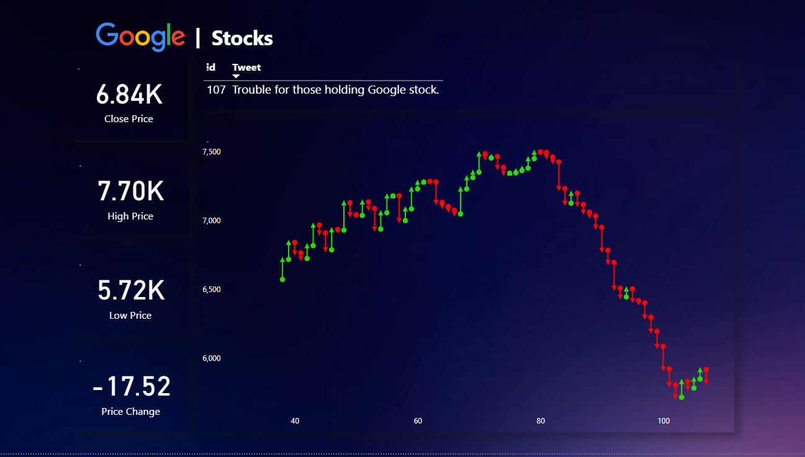

# Stock Market Analysis using Twitter Sentiments

This project is to leverage the vast amount of data available on Twitter to gauge the sentiment of users towards specific stocks. By analyzing tweets related to various stocks, we can gain insights into public opinion, which can potentially influence stock prices.

## Tech Stack

**Power BI**: Used for data visualization and reporting.

**Python**: Utilized for sentiment analysis of Twitter and Stocks data.

**MS SQL**: Serves as the database management system for storing and managing the Twitter and Stocks data. 

## DataSets

**Twitter Data**: To extract real-time tweets realted to stocks for sentiment analysis, providing insights into market sentiment and investor opinions.

**Emoji Dictionary Data**: To map emojis to sentiment categories, facilitating sentiment analysis of tweets containing emojis.

**Google Stocks Data**: To analyze stock data of Google for correlation with Twitter sentiment, aiding in understanding the impact of sentiment on stock prices.

**Tesla Stocks Data**: To analyze stock data of Tesla for correlation with Twitter sentiment, aiding in understanding the impact of sentiment on stock prices.

**Bitcoin Stocks Data**: To analyze data of Bitcoin prices for correlation with Twitter sentiment, aiding in understanding the impact of sentiment on cryptocurrency markets.
## Tables

**Fact Table**
* *Tweet ID*: Unique identifier for each tweet.
* *Sentiment ID*: Identifier for the sentiment analysis associated with the tweet.
* *Stock ID*: Identifier linking the tweet to a specific stock.
* *Emoji ID*: Identifier linking the tweet to a specific emoji, if applicable.
* *Username*: Username of the Twitter user who posted the tweet.

**Google Stocks Table**
* *Stock ID*: Unique identifier for each entry related to Google stocks.
* *DateTime*: Date and time of the stock data entry.
* *Open Price*: The opening price of Google stock at the beginning of the trading day.
* *High Price*: The highest price of Google stock during the trading day.
* *Low Price*: The lowest price of Google stock during the trading day.
* *Close Price*: The closing price of Google stock at the end of the trading day.
* *Volume*: The number of shares of Google stock traded during the trading day.
* *Adjusted Close*: The closing price of Google stock adjusted for corporate actions.

**Tesla Stocks Table**
* *Stock ID*: Unique identifier for each entry related to Tesla stocks.
* *DateTime*: Date and time of the stock data entry.
* *Open Price*: The opening price of Tesla stock at the beginning of the trading day.
* *High Price*: The highest price of Tesla stock during the trading day.
* *Low Price*: The lowest price of Tesla stock during the trading day.
* *Close Price*: The closing price of Tesla stock at the end of the trading day.
* *Volume*: The number of shares of Tesla stock traded during the trading day.
* *Adjusted Close*: The closing price of Tesla stock adjusted for corporate actions.

**Bitcoin Stocks Table**
* *Stock ID*: Unique identifier for each entry related to Bitcoin stocks.
* *DateTime*: Date and time of the stock data entry.
* *Open Price*: The opening price of Bitcoin at the beginning of the trading day.
* *High Price*: The highest price of Bitcoin during the trading day.
* *Low Price*: The lowest price of Bitcoin during the trading day.
* *Close Price*: The closing price of Bitcoin at the end of the trading day.
* *Volume*: The trading volume of Bitcoin during the trading day.
* *Adjusted Close*: The closing price of Bitcoin adjusted for corporate actions.

**Tweet Table**
* *Tweet ID*: Unique identifier for each tweet.
* *DateTime*: Date and time when the tweet was posted.
* *Username*: Username of the Twitter user who posted the tweet.
* *Tweet*: Text content of the tweet.
* *Emoji ID*: Identifier linking the tweet to a specific emoji, if applicable.
* *Hashtag*: Hashtags included in the tweet.
* *Hotness*: Indicator of tweet popularity or engagement.
* *Language*: Language of the tweet content.

**Sentiment Analysis**
* *Sentiment ID*: Unique identifier for each sentiment analysis entry.
* *Most Negative Sentiment Term*: The most negative term identified in the sentiment analysis.
* *Most Negative Sentiment Term Score*: Score associated with the most negative term.
* *Most Positive Sentiment Term*: The most positive term identified in the sentiment analysis.
* *Most Positive Sentiment Term Score*: Score associated with the most positive term.
* *Negative Word 1*: Additional negative word identified in the sentiment analysis.
* *Negative Word 2*: Additional negative word identified in the sentiment analysis.
* *Positive Word 1*: Additional positive word identified in the sentiment analysis.
* *Positive Word 2*: Additional positive word identified in the sentiment analysis.
* *Trusted Judgements*: Indicator of the reliability or trustworthiness of the sentiment analysis results.

**User Table**
* *Username*: Username of the Twitter user.
* *Full Name*: Full name of the Twitter user.
* *App*: Application or platform used by the user to post tweets.
* *Bio*: Bio or description provided by the user in their Twitter profile.
* *Favorites*: Number of tweets favorited by the user.
* *Followers*: Number of followers of the user.
* *Follows*: Number of accounts the user is following.

**Emoji Dictionary Table**
* *Emoji ID*: Unique identifier for each emoji entry.
* *Meaning*: Meaning or interpretation of the emoji.
* *Rencoding*: Encoding information of the emoji.
* *Unicode Codeprint*: Unicode representation of the emoji.
* *Unicode Shortname*: Shortname representation of the emoji.

# Objective

The objective of this project is to perform stock market analysis using Twitter sentiments. By leveraging a combination of Power BI, Python, and MS SQL, the project aims to extract, analyze, and visualize data from various sources to gain insights into market sentiment and its impact on stock prices.

## Key Goals

1. **Tweet Data Analysis**
*   At the very exact date and time, we filter out the tweets regarding stocks or the company.
*   We also keep a look at individuals having high shares in the stock market, at what they tweet.
*   Then, we filter out the most postive or least negative terms, as well as the most negative or least positive term.
*   We keep the confidence score for it.
*   Finally, we determine whether that tweets talks about having positive or negative impact at the Stock Price.

2. **Google, Tesla & BitCoin Stock Prices**
*   As a Time-Series Data, the datetime is the key here, no ids or primary key will help us.
*   Using the datetime, we look for the tweets posted within few minutes elapse, and analyze the Opening Price of the Stock, the High, Low and most importantly the Closing Price of the Stock.
*   The Adjusted Close is crucial to indicate the amount of increase or decrease in the Stocks Data.
*   With the volume data, we determine the number of shares bought or sold for that stock.

3. **User Data**
*   If the user is the company, or any high rank individual who bring more value to the tweet, we are more biased towards his sentiment.
*   Having the user data, helps us get the knowledge of providing weights to the score to calculate condfidence score for the sentiment.

4. **Emoji Dictionary**
*   Emoji and Emoticons language is used a lot on Twitter which can be crucial to understand what actually the person means.
*   We get the Unicode for the emoji used in the tweet and use the emoji dictionary to evaluate the meaning of the tweet.

## KPIs

1.  **Sentiment Analysis Accuracy**: Measure the accuracy of sentiment analysis algorithms in classifying tweets as positive, negative, or neutral sentiments.

2.  **Stock Price Correlation**: Assess the correlation between the sentiment of tweets and changes in stock prices to determine if there's a predictive relationship.

3.  **Volume of Mentions**: Track the volume of tweets mentioning specific stocks or market trends over time.

4.  **Engagement Metrics**: Analyze the level of engagement (likes, retweets, replies) on tweets related to stocks to gauge public interest and sentiment.

5.  **Social Media Influence**: Evaluate the influence of influential Twitter accounts or personalities on stock market sentiment.

6.  **Trend Identification**: Identify emerging trends or topics within the stock market discussions on Twitter.

7.  **Sentiment Distribution**: Visualize the distribution of sentiment (positive, negative, neutral) across different stocks or market sectors.

## Requirements

*   Twitter Data Access
*   Data Preprocessing
*   Sentiment Analysis Models
*   Stock Price Data
*   Integration with Power BI
*   Data Visualization
*   Documentation and Reporting

## Visualization Techniques & Components

Below is the Techniques and Components to be used

### Charts

1.  **Time Series Line Chart**: Displaying the trend of stock prices over time, overlaid with sentiment scores derived from Twitter data.

2.  **Bar Chart**: Comparing sentiment distribution (positive, negative, neutral) across different stocks or market sectors.

3.  **Heatmap**: Showing the correlation between sentiment scores and stock price movements over time.

4.  **KPI Card**: Displaying key metrics such as sentiment accuracy, stock price correlation, and volume of mentions.

5.  **Scatter Plot**: Visualizing the relationship between sentiment scores and stock price changes, with each point representing a specific time period.

### Filters

1.  **Date Range Filter**: Allowing users to select specific time periods for analysis, such as daily, weekly, or monthly data.

2.  **Date Range Filter**: Allowing users to select specific time periods for analysis, such as daily, weekly, or monthly data.

3.  **Date Range Filter**: Allowing users to select specific time periods for analysis, such as daily, weekly, or monthly data.

### Slicers

1.  **Top Influencers Slicer**: Allowing users to filter tweets based on the influence of Twitter accounts or personalities.

2.  **Trending Topics Slicer**: Enabling users to filter tweets based on emerging trends or topics within the stock market discussions.

